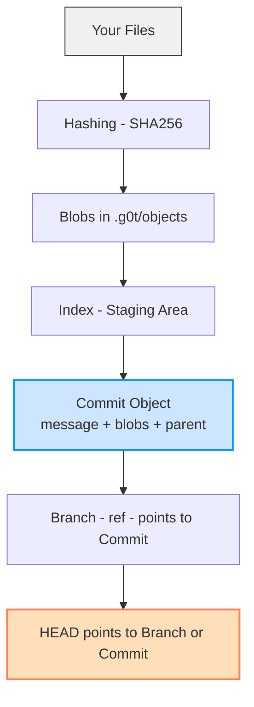

[](https://github.com/FrankOfTheScience/G0t-FileVersioningSystem/actions)

# G0t-FileVersioningSystem – A tiny, cursed version control system

> **"Git? Never heard of her. I G0t this."**

---

## 🧬 What is this madness?

**G0t** is a stupidly simple version control system I made while I was bored and thinking:  
*“How does Git even work under the hood?”*

So instead of watching yet another YouTube video about Git internals, I decided to build my own barebones clone.  
I called it **G0t** — because it’s a *messed-up spelling of Git*, and also a terrible pun on "*got files to commit*".  
You're welcome.

It’s dirty. It’s dumb. It *kinda* works.

---

## 🚀 What can it do?

Right now, **G0t** has the IQ of a wet potato. But it does the basics:

```bash
g0t init                     # Initializes a new G0t repo (.g0t folder)
g0t add <file>               # Stages a file (like 'git add')
g0t commit <message>         # Commits staged files with a message
g0t log                      # Shows the commit history (linear only, no DAG magic)
g0t branch <name>            # Creates a new branch pointing to current commit
g0t checkout <branch|hash>   # Switches to a branch or specific commit (detached HEAD moment)
```
Each commit creates a hash and stores:
-The commit message
-The list of file blobs
-A reference to the parent commit

Branches are just text files. Checkout just rewrites your files from the blob storage. It’s Git for cavemen, but we’re the cavemen with laser keyboards.

No merges. No rebase. No cherry-pick. No corporate overhead.

Just raw commit power.

## 🧠 How G0t Thinks (God help us)

### Commands

- `init`: Initializes a new repository (that you’ll probably forget about in 5 minutes).
- `commit`: Commit your files with a message. It’s like doing a git commit, but with a twist (and no “am I sure I want to commit this?”).
- `log`: Displays the commit log (like you really want to know what happened).

### Chart


### 📜 Commands Recap

|Command	|Description|
|--|--|
|init |	Initializes a new repository (you’ll forget it exists soon after).|
|add <file>|	Stages a file by hashing it and putting it in the index.|
|commit <msg>	|Commits the current index with a message, linking it to the previous commit.|
|log	|Walks the commit chain backwards and shows messages. No graph. No pizzazz.|
|branch <name>|	Creates a new branch pointing to the current commit.|
|checkout <target>|	Checks out a branch or commit. File system gets overwritten like it's 1999.|

So yeah. This thing is growing legs. Who knows what monstrosity it will become?

🦑

---

## 🧪 Why does this exist?
Honestly? I just wanted to learn how Git works, and writing a mini version control system is the best way to do that.

This is the result of:
- Too much coffee ☕
- Too much free time 😐
- And a deeply questionable sense of priorities 🧠

I might add more features. I might forget this exists next week.
¯\_(ツ)_/¯

---

## 📦 How to install
Install from NuGet:

```bash
dotnet tool install -g g0t
```
Now you can g0t from anywhere in your terminal. Literally.

Anyways you can find it in [Nuget.org](https://www.nuget.org/packages/g0t)

--- 

## 🧠 Philosophy
- No dependencies (except [Spectre.Console](https://spectreconsole.net/), because I love fancy terminal output)
- No magic
- All objects live under .g0t/objects
- Flat and readable by design — you could open the files with Notepad if you're feeling chaotic
- This is a tool for learning, not production. But hey — Git started in a week too 😏

## Is it stable?

Who knows? I just made this for fun. It’s probably missing a lot of important stuff. But hey, it works for small commits. Don’t use it for your critical projects unless you want to see some chaos. 🦸‍♂️

## Contributing & future plans?

Maybe I’ll add git diffs and other stuff. Maybe I’ll even add a nice little GUI. Or maybe not. Who cares? It’s not meant to be a full-fledged Git replacement.
You wanna contribute? Cool. Open a PR or drop an issue. Just don’t ask me to implement submodules. We don’t talk about submodules here.

--- 

## 💡 Credits
Made by FrankOfTheScience
Powered by poor life choices and C# 8.0

## 🖖 Live long and G0t commit.

